# 完整流程圖 Alpha Agent M0–M4 Pipeline / Complete Flowchart

```mermaid
flowchart TB
    subgraph INIT[Phase 0: Initialization / 初始化]
        direction TB
        I1[Load config & auth<br/>載入設定與認證] --> I2[Load idea_library<br/>載入種子庫]
        I2 --> I3[Load field metadata<br/>載入欄位 metadata]
        I3 --> I4[Create ResearchToolbox & Notebook<br/>建立工具箱與筆記本]
        I4 --> I5[Refresh seed queue<br/>刷新種子佇列]
    end

    subgraph LOOP[Phase 1: Main Loop · 1..max_iterations / 主迴圈]
        direction TB
        L1[Refresh seeds<br/>刷新種子] --> L2[Build leaderboard<br/>建立排行榜]
        L2 --> L3[determine_stage<br/>決定階段]
        L3 --> L4[Preview 3 candidate pools<br/>預覽候選池]
        L4 --> L5[rank_candidates<br/>排序候選]
        L5 --> L6[Planner decide action<br/>規劃器決定行動]
        L6 --> ACTION{Action / 行動}
    end

    subgraph GRID[M0→M2: Grid Pipeline · 72-cell / 網格管線]
        direction TB
        G1[select_cells: top-N by priority<br/>按優先順序選取 N 個 cell] --> G2{Expression method<br/>表達式方法}
        G2 -->|LLM CoT / 語言模型| G3[build_cot_prompt<br/>thesis + fields + operators<br/>建構提示：論文 + 欄位 + 運算元]
        G3 --> G4[LLM returns expression JSON<br/>語言模型回傳表達式]
        G2 -->|Template / 模板| G5[OPERATOR_TEMPLATES<br/>+ vary_expression<br/>運算元模板 + 變體]
        G4 --> G6[DeterministicValidator D6<br/>確定性驗證 D6]
        G5 --> G6
        G6 --> G7[JaccardDiversityGate<br/>Jaccard 多樣性過濾]
        G7 --> G8[Build SignalAlphaObject<br/>建立 SAO]
        G8 --> G9[to_candidate<br/>轉為 Candidate]
    end

    subgraph M3[M3: Brain Simulation / Brain 模擬]
        M3A[evaluate_batch<br/>批次評估] --> M3B[Receive results<br/>sharpe / fitness / checks<br/>接收結果：夏普 / 適應 / 檢查]
    end

    subgraph M35[M3.5: Error Recovery / 錯誤恢復]
        direction TB
        E1[Strategy 1: backoff<br/>策略一：指數退避] --> E2[Strategy 2: re-auth<br/>策略二：重新認證]
        E2 --> E3[Strategy 3: fresh login<br/>策略三：重新登入]
    end

    subgraph M4[M4: Repair Loop / 修復迴圈]
        direction TB
        F1[failure_taxonomy<br/>FM-1 ~ FM-6<br/>失敗分類] --> F2[ConvergenceGovernance<br/>收斂治理]
        F2 --> F3[Phase 1: correlation repair<br/>階段一：相關性修復<br/>Phase 2-3: catalog strategy<br/>階段二~三：目錄策略]
        F3 --> F4[Re-evaluate<br/>重新評估]
    end

    subgraph SUBMIT[Submission / 提交]
        direction TB
        H1[harvest stage only<br/>僅收穫階段] --> H2[auto_approved / manual<br/>自動 / 手動]
    end

    INIT --> LOOP

    LOOP -->|evaluate_grid<br/>評估網格| GRID
    LOOP -->|evaluate_seed / refine / diversify / robustness<br/>評估種子/精煉/多樣/穩健| M3

    GRID --> M3

    M3 -->|API error / API 錯誤| M35
    M35 -->|retry / 重試| M3
    M3 -->|check failed / 檢查失敗| M4
    M4 --> M3
    M3 -->|OK / done / 完成| LOOP

    LOOP -->|submit_best<br/>提交最佳| SUBMIT
    SUBMIT --> LOOP
    LOOP -->|stop / 停止| END[END / 結束]

    classDef init fill:#e1f5fe,stroke:#0288d1,color:#000
    classDef loop fill:#fff3e0,stroke:#f57c00,color:#000
    classDef grid fill:#e8f5e9,stroke:#388e3c,color:#000
    classDef m3 fill:#f3e5f5,stroke:#7b1fa2,color:#000
    classDef m35 fill:#fce4ec,stroke:#c62828,color:#000
    classDef m4 fill:#fff8e1,stroke:#fbc02d,color:#000
    classDef submit fill:#e0f2f1,stroke:#00796b,color:#000

    class GRID grid
    class M3 m3
    class M35 m35
    class M4 m4
    class SUBMIT submit
    class INIT init
    class LOOP loop
```

## 圖例

| 區塊 | 顏色 | 說明 |
|---|---|---|
| 藍色 | Init | 初始化階段 |
| 橙色 | Loop | 主迭代迴圈 |
| 綠色 | Grid | M0→M2 網格探索管線 |
| 紫色 | M3 | Brain 模擬 |
| 紅色 | M3.5 | API 錯誤恢復 |
| 黃色 | M4 | 修復迴圈 |
| 青色 | Submit | 最終提交 |

## 流程說明

1. **Phase 0**：載入設定與認證、種子庫、欄位 metadata，建立 ResearchToolbox 與 ResearchNotebook
2. **Phase 1**：反覆執行最多 `max_iterations` 次，每次由 Planner 決定下一步行動
3. **M0→M2 Grid**：從 72-cell grid 按優先順序選出 cell，透過模板或 LLM CoT 生成表達式；經 D6 驗證與 Jaccard 多樣性過濾後包裝為 SignalAlphaObject
4. **M3**：將 SAO 轉為 Brain Candidate 提交模擬，回傳 sharpe、fitness、檢查結果
5. **M3.5**：API 連線失敗時依序嘗試 backoff → re-auth → fresh login
6. **M4**：若 Brain 檢查失敗，分類 failure mode (FM-1~6) 並套用對應修復策略（correlation repair / catalog strategy / LLM rewrite），收斂後重新提交
7. **Submission**：僅在 harvest 階段執行，支援自動或手動提交
