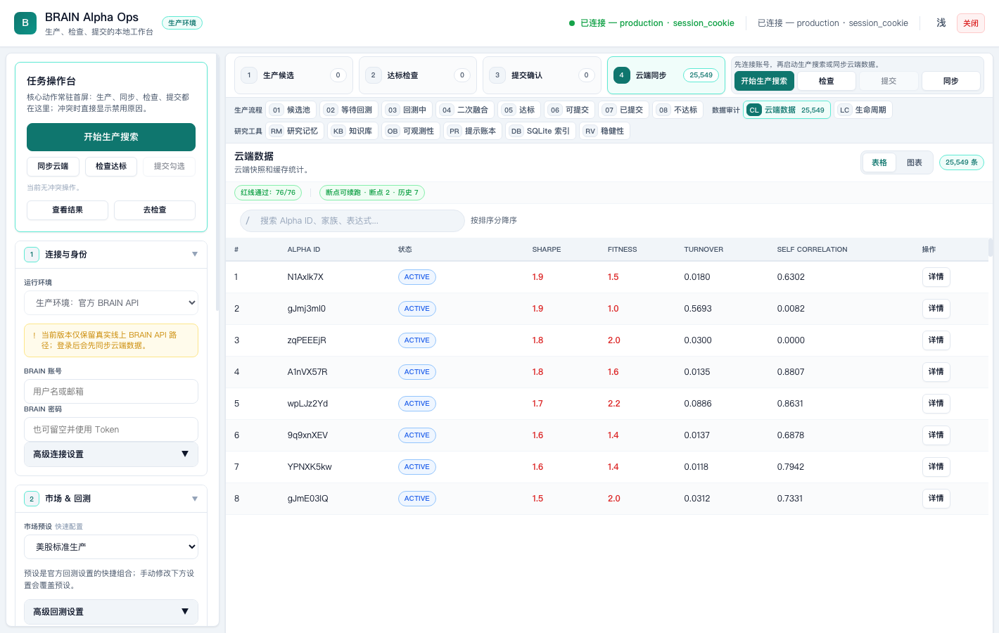
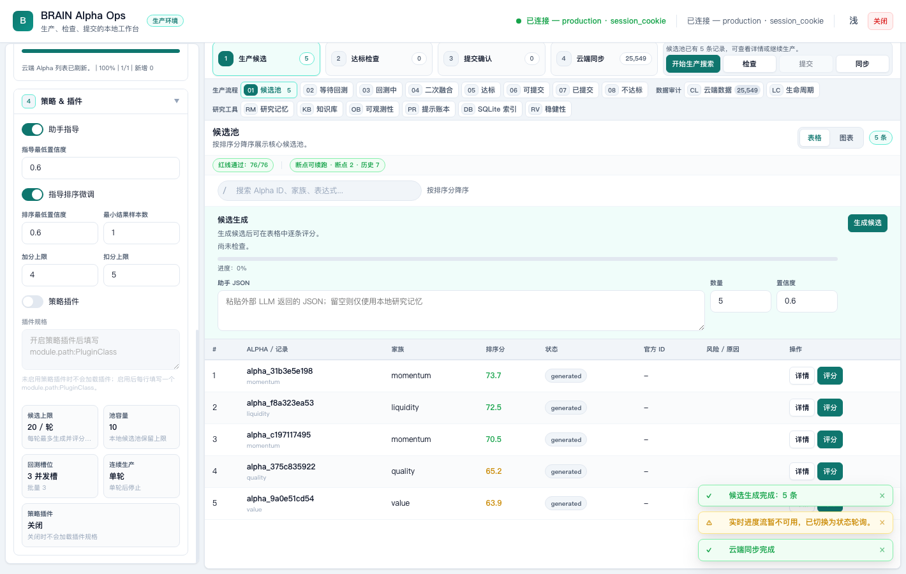
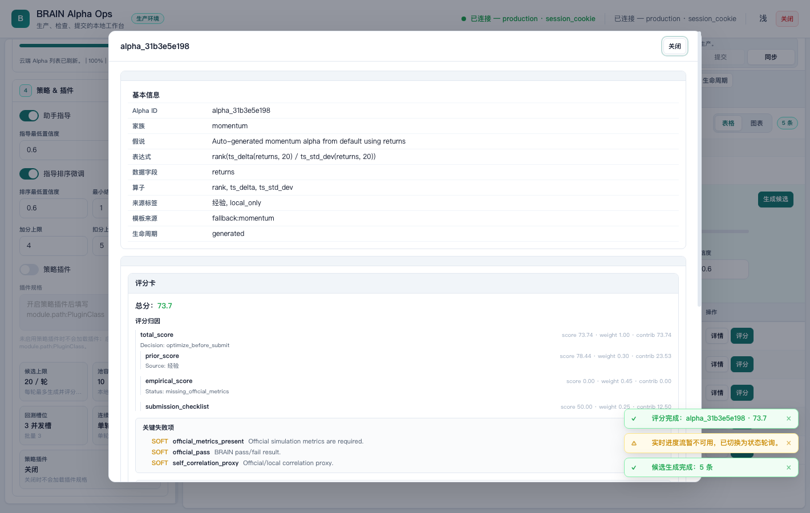
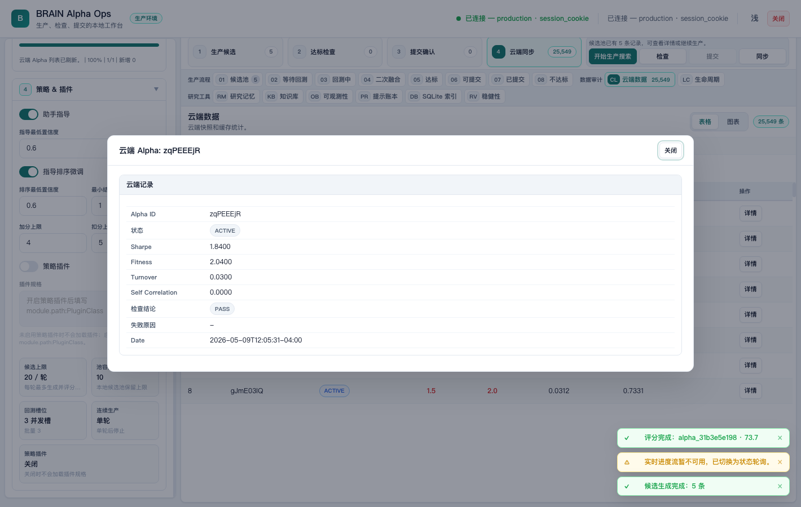
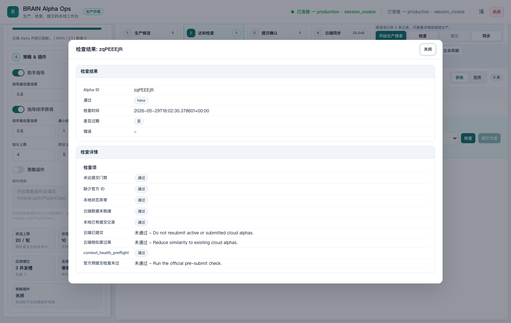
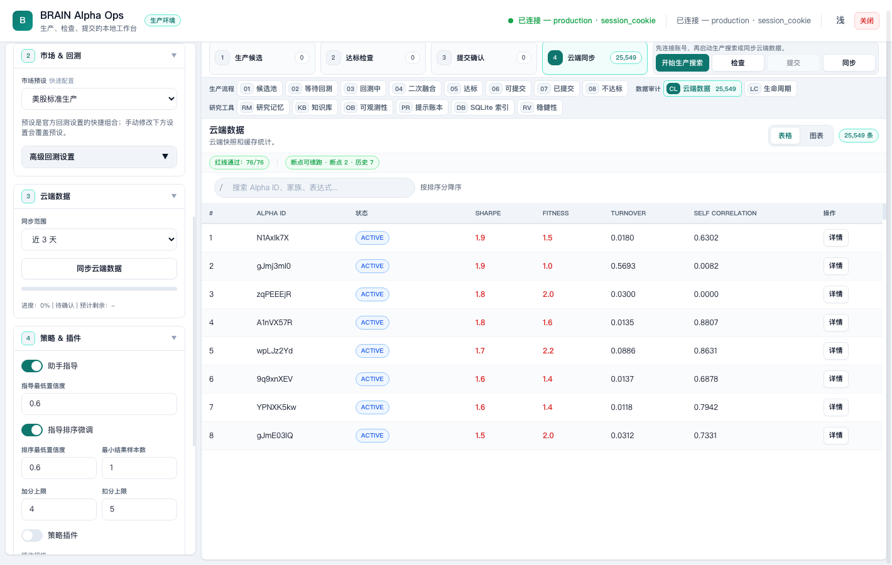
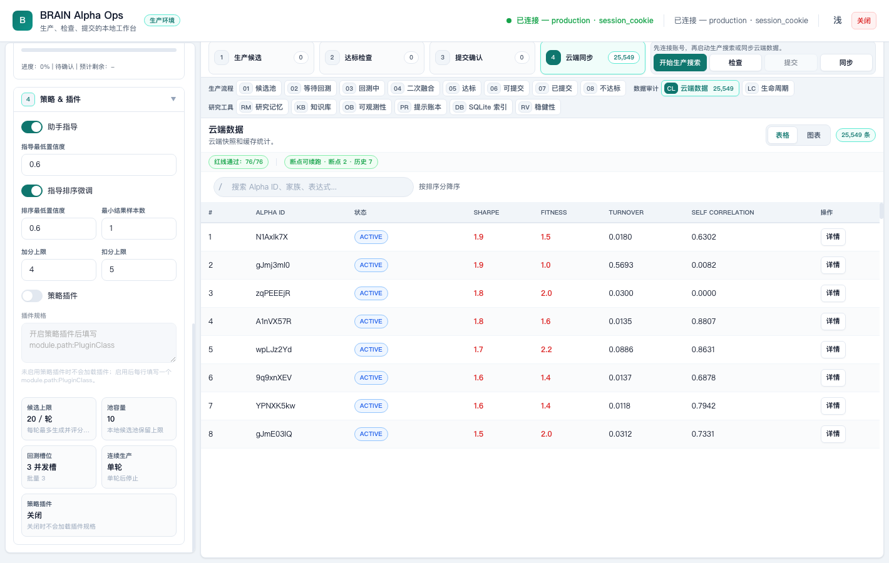
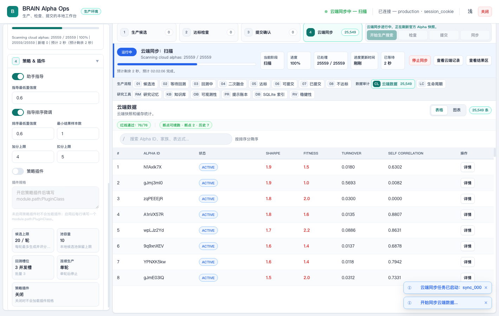

# BRAIN Alpha Ops

Local production workbench for WorldQuant BRAIN alpha research, validation, and submission review.


BRAIN Alpha Ops runs on your machine and talks to the official WorldQuant BRAIN API from a local browser page. Use it to connect your account, sync cloud alphas, discover candidates, score and validate ideas, review submission readiness, and monitor long-running jobs without losing sight of what is happening.

The screenshots in this manual live in [docs/screenshots](docs/screenshots/). They are captured from the production UI with real BRAIN data, including real Alpha IDs such as `N1Axlk7X`, `gJmj3ml0`, `zqPEEEjR`, and numeric official metrics such as Sharpe, Fitness, Turnover, and Self Correlation. No mock data, placeholder rows, passwords, or tokens are used in the screenshots.

## Quick Start

### Prerequisites

Before you launch the workbench, make sure you have:

1. Python 3.10 or newer.
2. Network access to `https://api.worldquantbrain.com`.
3. A WorldQuant BRAIN account.
4. Google Chrome, Edge, Safari, or Firefox. The production screenshots in this manual were verified in Google Chrome.
5. This repository checked out locally.

### Install

macOS / Linux:

```bash
cd WorldQuant-BRAIN-Alpha
python3 -m venv .venv
source .venv/bin/activate
python3 -m pip install --upgrade pip
python3 -m pip install -e ".[test]"
```

Windows PowerShell:

```powershell
cd WorldQuant-BRAIN-Alpha
python -m venv .venv
.\.venv\Scripts\Activate.ps1
python -m pip install --upgrade pip
python -m pip install -e ".[test]"
```

### Set Credentials

Use environment variables for credentials:

```bash
export BRAIN_USERNAME="your_email_here"
export BRAIN_PASSWORD="your_password_here"
```

You can also use `BRAIN_TOKEN`. Do not write real credentials into `README.md`, `config/run_config.json`, screenshots, commits, or logs.

### Launch

```bash
python3 launch_web.py
```

Open:

```text
http://127.0.0.1:8765
```

The production surface is the local HTML/JS console served by `launch_web.py`. A React mirror is also available for development:

```bash
cd brain_alpha_ops/web/react_app
npm run dev
```

To preview the built React artifact through the same local backend, opt in explicitly:

```bash
python3 launch_web.py --frontend react --no-browser
```

Without `--frontend react` or `BRAIN_ALPHA_OPS_WEB_FRONTEND=react`, `launch_web.py` continues to serve the inline production console by default.

### First Login

1. Open the local workbench in Chrome.
2. Confirm the runtime is `production`.
3. Click the connection test button. If credentials are in environment variables, you do not need to type them into the page.
4. Wait for the connection result before starting sync, generation, checks, or submission review.
5. Choose `7d` for a fresh cloud sync when you want the latest production context.



## Core Features

### Connection & Authentication

The connection panel verifies that the local server can authenticate against the official BRAIN API. In production mode, authentication uses `BRAIN_USERNAME` / `BRAIN_PASSWORD` or `BRAIN_TOKEN`; the browser session receives only local session and CSRF state.

Successful authentication enables cloud sync, candidate generation, official scoring, batch checks, and submission review. Failed authentication returns a visible error message instead of leaving the interface frozen.


### Dashboard Overview

The dashboard is the daily starting point. It shows cloud alpha inventory, production workflow counts, research memory, checkpoint status, redline status, and the current runtime state.

Cloud totals are not guessed. The workbench reads the full cloud cache, deduplicates by real Alpha ID, and displays the actual count it has loaded. In the captured production session, the cloud view shows `25,549` alphas and real records such as `N1Axlk7X`, `gJmj3ml0`, `zqPEEEjR`, and `A1nVX57R`.

`Last updated` and similar freshness labels describe when the local cache or progress state was refreshed. They do not describe Alpha quality, submission status, or whether an Alpha is new.


The cloud table includes official metrics from BRAIN. `Self Correlation` shows the numeric value returned by the API when available; when BRAIN has not completed the check, the UI shows the official state such as `PENDING`.


### Candidate Discovery

Candidate discovery starts from **Start production search** or the candidate generation action. The generator uses the current production configuration, official context cache, and research memory to create real candidate records for review.

Typical flow:

1. Test the production connection.
2. Sync cloud alphas for `7d` so existing account context is available.
3. Generate candidates.
4. Filter by Alpha ID, family, expression, score, or lifecycle status.
5. Score or check the candidates you want to advance.

The candidate table never uses mock rows. If no real candidate records exist, it stays empty with explicit actions; after generation, it displays the generated candidate IDs, expressions, scorecards, and lifecycle status.



### Scoring & Validation

Scoring and validation help you decide whether a candidate is ready for more official work. The scoring flow combines local scorecards, official metrics, gate checks, anti-overfit context, rolling validation context, and BRAIN check results.

Use this view to inspect:

1. Sharpe, Fitness, Turnover, Returns, Drawdown, and Self Correlation.
2. Hard and soft gate status.
3. Top failure reasons and improvement hints.
4. Anti-overfit and rolling validation evidence.
5. Whether a candidate should remain research-only, be optimized, or proceed to submission review.



Alpha details preserve the official status returned by BRAIN. For example, the production cloud data includes active Alpha IDs with numeric Self Correlation values such as `0.6302`, `0.0082`, and `0.0000`.



### Submission Workflow

Submission is intentionally staged. The workbench separates check, review, and submit so you can see why an Alpha is blocked before any irreversible action.

Recommended flow:

1. Select only Alpha records that are eligible for review.
2. Run pre-submit check or batch check.
3. Review duplicate risk, cloud status, observability warnings, and failed BRAIN checks.
4. Confirm the submission intent.
5. Submit only after checks are visible and current.

Batch submission uses the same progress channel as other long-running operations. The UI keeps the submit action disabled while another conflicting job is running.



### Configuration

Configuration controls the production profile used by generation, sync, validation, and submission review. Start with the provided US equity production preset, then adjust region, universe, delay, neutralization, decay, truncation, and data handling only when you need a specific research scope.



Strategy settings include assistant guidance, guidance score adjustment, confidence thresholds, and local strategy plugin loading. Disabled plugins are not loaded.



### Monitoring

Long-running operations always show progress. Cloud sync, candidate generation, scoring, batch check, and batch submit all publish the same progress contract:

| Field | Meaning |
|---|---|
| `task_id` | Stable job identifier for status polling and SSE |
| `phase` | Current stage, such as `scan`, `candidate_generation`, `scoring`, `checking`, or `submitting` |
| `percent_complete` | Determinate progress value when it can be calculated |
| `eta_seconds` | Remaining time estimate when available |
| `status_message` | Human-readable message for the current phase |

The frontend displays a determinate bar when progress is known and an indeterminate state when the backend is waiting on the official API. Errors include a retry path instead of a silent failure.



## Architecture

BRAIN Alpha Ops is local-first. The browser talks to a loopback HTTP server, and the server talks to the official BRAIN API.

| Layer | Files | Purpose |
|---|---|---|
| Web server | [brain_alpha_ops/web.py](brain_alpha_ops/web.py) | Local HTTP server and runtime facade |
| Routes | [brain_alpha_ops/web_routes.py](brain_alpha_ops/web_routes.py), [brain_alpha_ops/web_handler_dispatch.py](brain_alpha_ops/web_handler_dispatch.py) | GET/POST routing, session checks, replay protection |
| Progress | [brain_alpha_ops/web_progress.py](brain_alpha_ops/web_progress.py), [brain_alpha_ops/web_async_jobs.py](brain_alpha_ops/web_async_jobs.py) | Unified progress fields, async jobs, SSE/status payloads |
| Production jobs | [brain_alpha_ops/web_sync_job.py](brain_alpha_ops/web_sync_job.py), [brain_alpha_ops/web_check_batch_job.py](brain_alpha_ops/web_check_batch_job.py), [brain_alpha_ops/web_submission_batch.py](brain_alpha_ops/web_submission_batch.py) | Sync, batch check, and batch submit work |
| BRAIN API | [brain_alpha_ops/brain_api](brain_alpha_ops/brain_api) | Official authentication, pagination, metrics normalization |
| Scoring | [brain_alpha_ops/web_redline_scoring.py](brain_alpha_ops/web_redline_scoring.py), [brain_alpha_ops/scoring](brain_alpha_ops/scoring) | Scorecards, redlines, gates, attribution |
| Frontend | [brain_alpha_ops/web/js](brain_alpha_ops/web/js), [brain_alpha_ops/web/react_app](brain_alpha_ops/web/react_app) | Production console and React mirror |
| Storage | [data](data) | JSONL caches, job state, run history, research memory |

Key endpoints:

| Endpoint | Purpose |
|---|---|
| `POST /api/test_connection` | Verify production authentication |
| `POST /api/sync_alphas` | Start cloud alpha sync |
| `GET /api/cloud_alphas` | Read cloud alpha snapshot |
| `POST /api/generate_candidates` | Start candidate generation |
| `POST /api/scoring/evaluate` | Score a candidate |
| `POST /api/check_batch` | Run batch pre-submit checks |
| `POST /api/submit_batch` | Start batch submission |
| `GET /sse?job_id=...` | Stream job progress |
| `GET /api/status?job_id=...` | Poll job status |

## Appendix: Verification

Verification focuses on production behavior, not demo data.

1. Authentication was exercised through the production BRAIN API using environment-provided credentials.
2. Cloud sync and `GET /api/cloud_alphas` displayed real BRAIN Alpha IDs and official metrics.
3. Candidate generation, scoring, batch check, and batch submit route through async job stores with SSE/status progress.
4. Self Correlation is normalized from official metrics or BRAIN check state and displayed as a number or official status.
5. The UI renders explicit feedback for loading, progress, success, and error states.
6. Local safety controls include loopback origin checks, session cookies, CSRF, replay protection, submit locks, and credential redaction.

Useful verification commands:

```bash
python3 brain_alpha_ops/web/build_inline.py --check --json
python3 scripts/check_frontend_syntax.py --json
python3 -m pytest tests/test_web_async_jobs.py tests/test_web_progress.py tests/test_web_cloud_snapshot.py -q
python3 -m pytest tests/test_web_handler_dispatch.py tests/test_web_post_handlers.py tests/test_web_check_batch_job.py tests/test_web_submission_batch.py -q
python3 -m pytest tests/test_official_adapter.py -q
python3 scripts/final_release_gate.py --json
```
